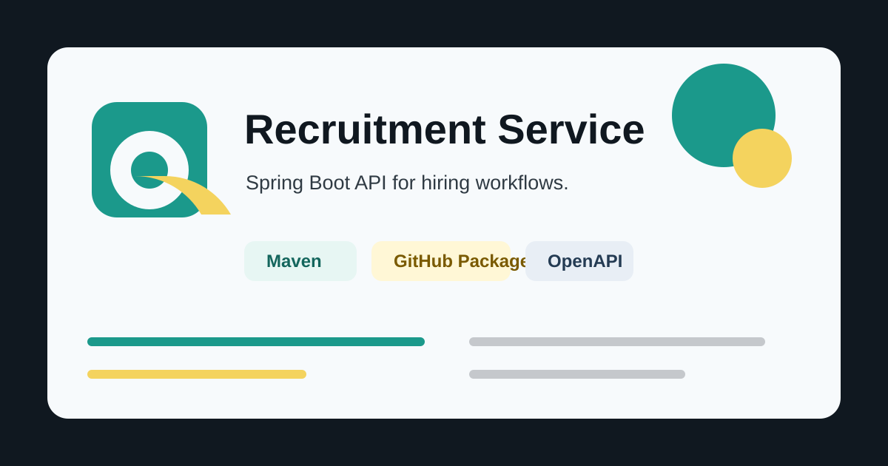

# Recruitment Service

Spring Boot recruitment API for employers, jobs, seekers, resumes, authentication, metrics, and GitHub Packages publishing.

## Features

- JWT login with Spring Security resource server support.
- CRUD APIs for employers, jobs, seekers, and resumes.
- Paginated list endpoints with filtering by employer, seeker, or province where supported.
- Metrics endpoint for employer, job, seeker, and resume counts by date range.
- OpenAPI UI through SpringDoc.
- MySQL persistence, optional Redis cache, Prometheus metrics, and Sentry integration.
- Maven CI and GitHub Packages publishing workflow.

## Tech Stack

- Java 17
- Spring Boot 3.4.5
- Spring Web, Security, OAuth2 Resource Server, Data JPA, Validation, Actuator
- MySQL, Redis, H2 for tests
- Maven, Checkstyle, SpringDoc OpenAPI

## Run Locally

Start MySQL and Redis from the bundled compose files:

```bash
docker compose -f src/docker-compose/mysql/docker-compose.yml up -d
docker compose -f src/docker-compose/redis/docker-compose.yml up -d
```

Load the bundled database dump:

```bash
docker compose -f src/docker-compose/mysql/docker-compose.yml exec -T mysql-db mysql -uroot -pAdmin@123 < src/docker-compose/mysql/db-dumps/all-databases.sql
```

Run the API:

```bash
./mvnw spring-boot:run
```

Windows PowerShell:

```powershell
.\mvnw.cmd spring-boot:run
```

Default API URL: `http://localhost:9191`

OpenAPI UI: `http://localhost:9191/swagger-ui/index.html`

## Configuration

Main runtime settings are environment-driven:

| Variable | Default |
| --- | --- |
| `SERVER_PORT` | `9191` |
| `SPRING_DATASOURCE_URL` | `jdbc:mysql://127.0.0.1:3306/job_db` |
| `SPRING_DATASOURCE_USERNAME` | `root` |
| `SPRING_DATASOURCE_PASSWORD` | `Admin@123` |
| `SPRING_CACHE_TYPE` | `simple` |
| `SPRING_DATA_REDIS_HOST` | `localhost` |
| `SPRING_DATA_REDIS_PORT` | `6379` |
| `SPRING_DATA_REDIS_PASSWORD` | `Redis@123` |
| `SENTRY_DSN` | empty |

Set `SPRING_CACHE_TYPE=redis` to use Redis cache in runtime.

## API Quick Reference

Login:

```http
POST /auth/login
Content-Type: application/json

{
  "username": "user",
  "password": "password"
}
```

Use the returned `accessToken` as a bearer token for protected endpoints.

JWT signing keys are generated at application startup for local development and tests. Configure persistent keys before running multiple production instances.

| Resource | Endpoints |
| --- | --- |
| Employers | `GET /employers`, `POST /employers`, `GET /employers/{id}`, `PUT /employers/{id}`, `DELETE /employers/{id}` |
| Jobs | `GET /jobs`, `POST /jobs`, `GET /jobs/{id}`, `PUT /jobs/{id}`, `DELETE /jobs/{id}` |
| Seekers | `GET /seekers`, `POST /seekers`, `GET /seekers/{id}`, `PUT /seekers/{id}`, `DELETE /seekers/{id}` |
| Resumes | `GET /resumes`, `POST /resumes`, `GET /resumes/{id}`, `PUT /resumes/{id}`, `DELETE /resumes/{id}` |
| Metrics | `GET /metrics?fromDate=2026-07-01&toDate=2026-07-19` |
| Health | `GET /actuator/health` |

## Build And Test

```bash
./mvnw verify
```

Tests use H2 and cache disabled through `src/test/resources/application.yml`.

## Publish To GitHub Packages

This repository is configured for Maven publication to GitHub Packages:

```xml
<dependency>
  <groupId>vn.unigap</groupId>
  <artifactId>recruitment-service</artifactId>
  <version>0.1.0-SNAPSHOT</version>
</dependency>
```

The package publishes the standard Maven jar plus an executable Spring Boot jar with the `exec` classifier.

Package repository:

```xml
<repository>
  <id>github</id>
  <url>https://maven.pkg.github.com/restom0/BEC-recruitment-service</url>
</repository>
```

Publishing is handled by `.github/workflows/publish-package.yml` on pushes to `main`, GitHub release creation, or manual workflow dispatch. The workflow uses `GITHUB_TOKEN` with `packages: write`; consumers of private packages need a GitHub token with `read:packages`.

## Project Structure

```text
src/main/java/vn/unigap/api
  controller/    REST controllers
  dto/           request and response payloads
  entity/        JPA entities
  repository/    Spring Data repositories
  service/       business logic
src/main/java/vn/unigap/authentication
  JWT and security configuration
src/main/java/vn/unigap/common
  shared response and exception helpers
src/docker-compose
  MySQL, Redis, Prometheus, Grafana, and Mongo compose helpers
```
